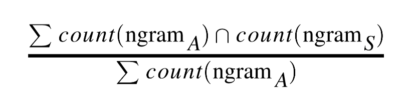

# Plagiarism Project, Machine Learning Deployment

This repository contains code and associated files for deploying a plagiarism detector using AWS SageMaker.

## Project Overview

This project comprises building a plagiarism detection tool that examines a text file and performs binary classification; labeling that file as either *plagiarized* or *not*, depending on how similar that text file is to a provided source text. Detecting plagiarism is an active area of research; the task is non-trivial and the differences between paraphrased answers and original work are often not so obvious.

We use two ways to find the similarity between the Wikipedia Source Text (S) and the Student Answer Text (A):

* **Containment Values:** defined as the intersection of the n-gram word count of the (S) with the n-gram word count of the (A) divided by the n-gram word count of the (A).  

* **Longest Subsequence count:** is the longest string of words (or letters) that are the same between (S) and (A). This value is also normalized by dividing by the total number of words (or letters) in the Student Answer Text.

This project is broken down into three main notebooks:

**Notebook 1: Data Exploration**
* Load in the corpus of plagiarism text data.
* Explore the existing data features and the data distribution.

**Notebook 2: Feature Engineering**

* Clean and pre-process the text data.
* Define features for comparing the similarity of an answer text and a source text, and extract similarity features.
* Select "good" features, by analyzing the correlations between different features.
* Create train/test `.csv` files that hold the relevant features and class labels for train/test data points.

**Notebook 3: Train and Deploy Your Model in SageMaker**

* Upload the train/test feature data to S3.
* Define a binary classification model and a training script.
* Train your model and deploy it using SageMaker.
* Evaluate your deployed classifier.

## Model Used
Linear Regression  
Linear SVC- scikit-learn (custom model)

## Evaluation Method
Accuracy Score, Confusion Matrix (for investigating FPs and FNs)

## Results
Linear Regression: Accuracy score of 92% with 2 FPs  
Linear SVC: Accuracy score of 100% with 0 FPs

## Getting Started
* Run 1_Data_Exploration.ipynb
* Run 2_Plagiarism_Feature_Engineering.ipynb
* Run 3_Training_a_Model.ipynb
Execute each cell line by line in all the above stated files. Instructions to setup data, AWS-Sagemaker, S3 bucket has been provided in the cells as code lines. Simply execute the cells in order.

## Author
* **Rupali Sinha** - *Initial work*
